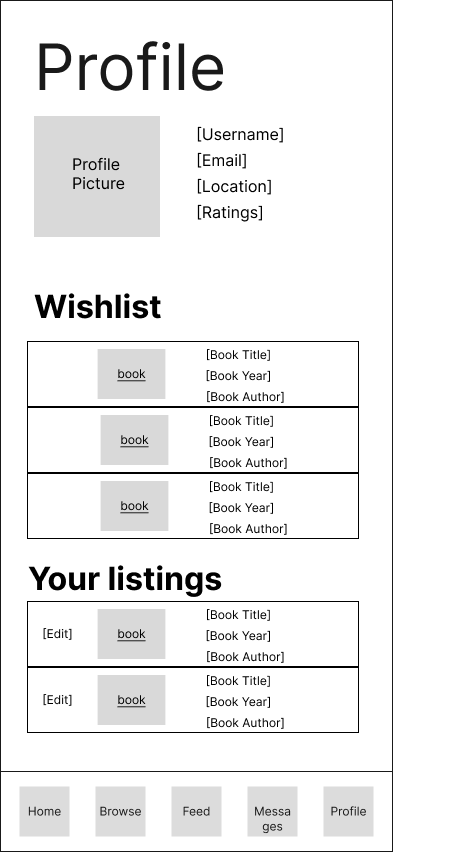

# User Experience Design

This repository contains instructions and files for two assignments that together comprise the user experience design phase of a web app.

Replace the contents of this file with the completed assignments, as described in:

- [app map & wireframe instructions](instructions-0a-app-map-wireframes.md).
- [prototype instructions](instructions-0b-prototyping.md)

## App Map

## Wireframe

### Login
#### Allows users to login their account

### Home
#### Shows recommended books and allows users to navigate to other pages

### Feed
#### Allows users to browse details of recommended books

### Sample Book
#### Allows users to look at a sample of a book

### Messages
#### Allows users to see messages from other users

### Browse
#### Shows different book catagories

### Popular Now
#### Allows users to browse books that are popular right now

### Newly Added
#### Allows users to browse books that are newly added

### Subgenre
#### Allows users to browse books of a specific subgenre

### Search
#### Allows users to search for books

### Profile
#### Allows users to see their wishlist, book listings, as well as personal information

## Prototype

Check out the interactive **Figma prototype** [here](https://www.figma.com/proto/mTtO288qBp6ErwVw8rN2Ry/Book-Broker?node-id=45-1108&p=f&t=Co9qNqKvBAsvI4ic-1&scaling=scale-down&content-scaling=fixed&page-id=0%3A1&starting-point-node-id=45%3A1108).